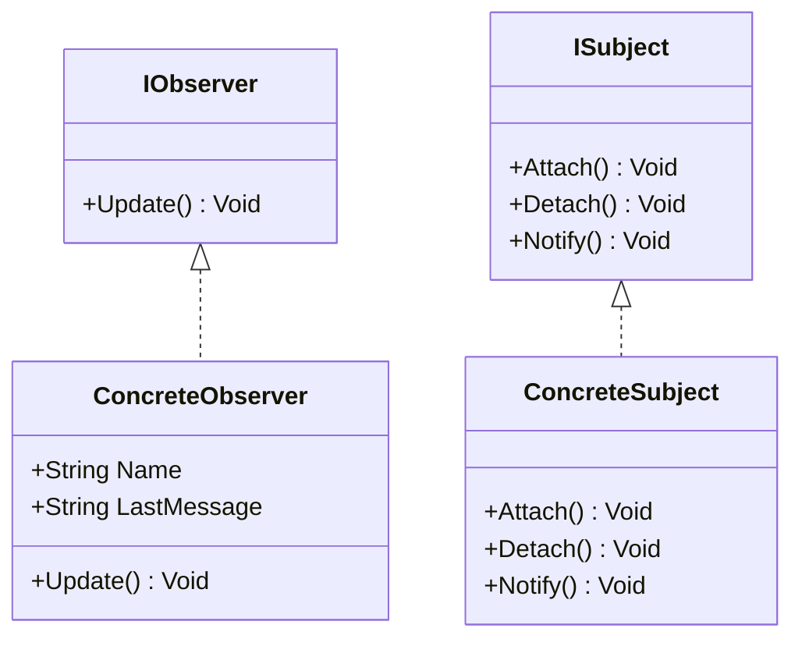

# Proyecto de Laboratorio - Sesion 03: Patrones de Diseño de Comportamiento

## Nuevo Proyecto: `Comportamiento`


### Patrón Elegido
**Observer (Observador)**: Este patrón define una dependencia uno a muchos entre objetos, de modo que cuando uno cambie su estado, todos sus dependientes son notificados y actualizados automáticamente.

---

# Instrucciones de Implementación

## 1. Crear la Solución y Proyectos
```bash
# Crear solución
mkdir Comportamiento
cd Comportamiento
dotnet new sln -o Comportamiento

# Crear proyectos
cd Comportamiento
dotnet new classlib -o Comportamiento.Domain
dotnet new nunit -o Comportamiento.Domain.Tests

# Agregar proyectos a la solución
dotnet sln add ./Comportamiento.Domain/Comportamiento.Domain.csproj
dotnet sln add ./Comportamiento.Domain.Tests/Comportamiento.Domain.Tests.csproj

# Referenciar dominio en pruebas
dotnet add ./Comportamiento.Domain.Tests/Comportamiento.Domain.Tests.csproj reference ./Comportamiento.Domain/Comportamiento.Domain.csproj
```

## 2. Implementación del Patrón Observer

### Crear interfaz `IObserver`
`Comportamiento.Domain/IObserver.cs`
```csharp
namespace Comportamiento.Domain
{
    public interface IObserver
    {
        void Update(string message);
    }
}
```

### Crear interfaz `ISubject`
`Comportamiento.Domain/ISubject.cs`
```csharp
namespace Comportamiento.Domain
{
    public interface ISubject
    {
        void Attach(IObserver observer);
        void Detach(IObserver observer);
        void Notify(string message);
    }
}
```

### Crear clase `ConcreteSubject`
`Comportamiento.Domain/ConcreteSubject.cs`
```csharp
using System.Collections.Generic;

namespace Comportamiento.Domain
{
    public class ConcreteSubject : ISubject
    {
        private List<IObserver> _observers = new List<IObserver>();

        public void Attach(IObserver observer)
        {
            _observers.Add(observer);
        }

        public void Detach(IObserver observer)
        {
            _observers.Remove(observer);
        }

        public void Notify(string message)
        {
            foreach (var observer in _observers)
            {
                observer.Update(message);
            }
        }
    }
}
```

### Crear clase `ConcreteObserver`
`Comportamiento.Domain/ConcreteObserver.cs`
```csharp
namespace Comportamiento.Domain
{
    public class ConcreteObserver : IObserver
    {
        public string LastMessage { get; private set; } = string.Empty;

        public void Update(string message)
        {
            LastMessage = message;
        }
    }
}
```

## 3. Crear pruebas unitarias

`Comportamiento.Domain.Tests/ObserverTests.cs`
```csharp
using NUnit.Framework;
using Comportamiento.Domain;

namespace Comportamiento.Domain.Tests
{
    public class ObserverTests
    {
        [Test]
        public void WhenSubjectNotifiesObservers_AllObserversReceiveUpdate()
        {
            var subject = new ConcreteSubject();
            var observer1 = new ConcreteObserver();
            var observer2 = new ConcreteObserver();

            subject.Attach(observer1);
            subject.Attach(observer2);

            subject.Notify("New Update!");

            Assert.AreEqual("New Update!", observer1.LastMessage);
            Assert.AreEqual("New Update!", observer2.LastMessage);
        }

        [Test]
        public void WhenObserverIsDetached_ItDoesNotReceiveNotifications()
        {
            var subject = new ConcreteSubject();
            var observer = new ConcreteObserver();

            subject.Attach(observer);
            subject.Detach(observer);

            subject.Notify("Should Not Receive");

            Assert.AreEqual(string.Empty, observer.LastMessage);
        }
    }
}
```

## 4. Ejecutar pruebas
```bash
dotnet test --collect:"XPlat Code Coverage"
```

---

# Estructura del Patrón Observer

- **Subject (ISubject)**: Define métodos para adjuntar, separar y notificar observadores.
- **ConcreteSubject**: Implementa el `ISubject`, almacena la lista de observadores y los notifica.
- **Observer (IObserver)**: Define la interfaz de actualización que es llamada por el `Subject`.
- **ConcreteObserver**: Implementa `IObserver` y actualiza su estado en respuesta a las notificaciones.

---

# Comando para generar diagrama de clases
```bash
dotnet tool install --global dll2mmd
dll2mmd -f Comportamiento.Domain/bin/Debug/net8.0/Comportamiento.Domain.dll -o comportamiento.md
```

---



---
# Observaciones
Este patrón es muy útil cuando varios objetos necesitan estar informados de cambios en otro objeto sin acoplamiento fuerte.


